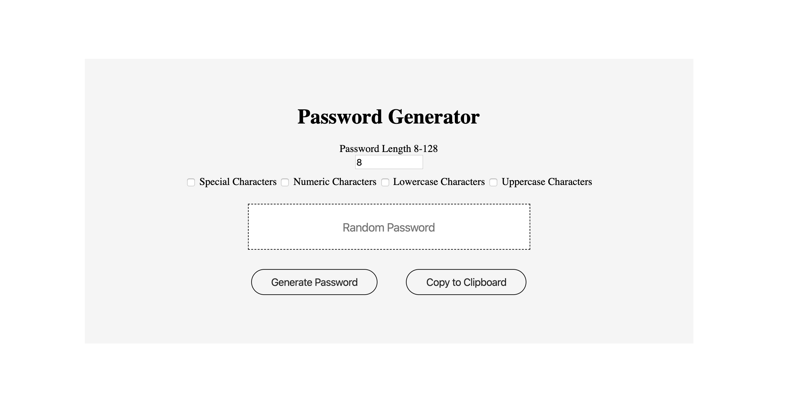

# Password Generator
Author: Ernesto Rodriguez

## Summary
This is an user friendly password generator built in JavaScript. This app gets user input which is used to generate a unique and random password.

**The user can choose between:**
* Password length
* Special Characters
* Numbers
* Lowercase Letters
* Uppercase Letters

## User Interface

## Deployed App
You can find the deployed application [here](https://erodrigueztoimil.github.io/password_generator/).
